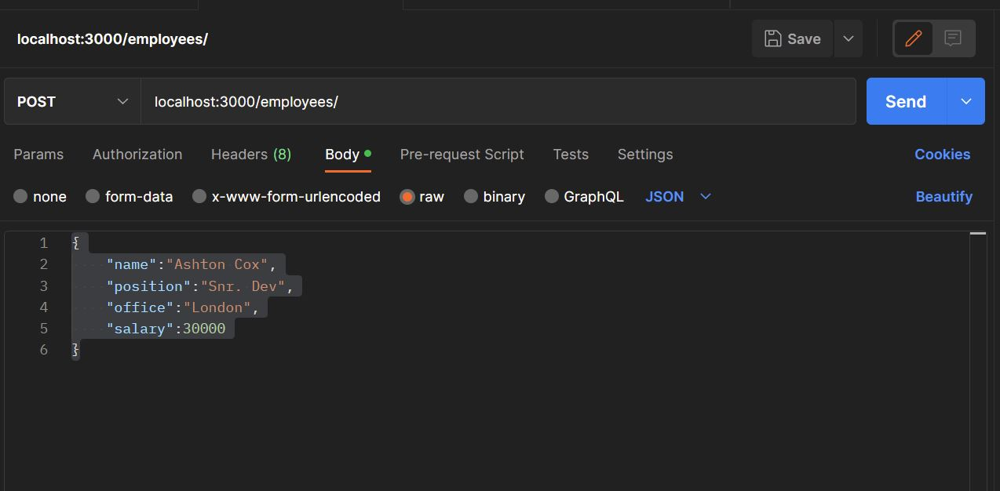

<<<<<<< HEAD
<link href="sample.css" rel="stylesheet"></link>

# Install for MEAN environment

## NodeJS
[NodeJS](https://nodejs.org/en/download/)


## MongoDB


[MongoDB (msi)](https://www.mongodb.com/try/download/community?tck=docs_server)


In command prompt navigate to the MongoDB bin folder, run ```mongod.exe``` and select the folder you want to save your database in when working with a local MongoDB server

```
cd C:....\Programfiles\MongoDB\Server\(-v)\bin
mongod.exe --dbpath C:\mongodata 
```
In MongoDB Compass Community create a Database Name and collection name.

eg. 

Database Name | Collection Name
--------| -------
CrudDB |  Employees

## Angular

```
> npm install -g @angular/cli
```

## Creating the Project and Directories (Folder paths)

Open new project folder in VScode (or relevant IDE).
Create a new folder for NodeJS application.

```
..\Project> mkdir NodeJS
..\Project> cd \NodeJS
..\Project\NodeJS> npm init
```
Agree to all the queries to create the _package.json_ file.

## Installing the rest of the dependencies for MEAN stack

Install dependencies: mongoose, express, body-parser and save dependencies in _package.json_ file.

```
> npm i express mongoose body-parser --save
```

Install 'nodemon' so that you do not need to shutdown and reconnect your node and mongodb server everytime you update anything on a file.

```
> npm i -g nodemon
```

# Connect database to Node server

Create a new .js file in _NodeJS_ folder to run the database server called _db.js_

```javascript
const mongoose = require('mongoose');
mongoose.set('strictQuery', true);

//Connect to the MongoDB Database name
//27017 is an arbitrary port to avoid port 3000
mongoose.connect('mongodb://localhost:27017/CrudDB', (err) => {
    if(!err)
        console.log('MongoDB connection succeeded.');
    else 
        console.log('Erorr in DB connection : ' + JSON.stringify(err, undefined, 2));
});

//connection needs to be established outside of this file most of the time
module.exports = mongoose;
```
create a new file _index.js_ inside the NodeJS folder.

In the _index.js_ file;

1. Import the Express and Body Parser packages

```javascript
const express = require('express');
const bodyParser = require('body-parser');
```
2. Import from local folder the mongoose connection. (Here we use the [destructering syntax for js](https://developer.mozilla.org/en-US/docs/Web/JavaScript/Reference/Operators/Destructuring_assignment)). This is importing the ``` module.exports = mongoose;``` from the _db.js_ file.

```javascript
const { mongoose } = require('./db.js');
```

3. Call the Express function and save in variable 'app'.

```javascript
var app = express();
```
4. Configure express middleware to send JSON data to the NodeJS project using [body-parser](https://www.npmjs.com/package/body-parser#bodyparserrawoptions).

```javascript
app.use(bodyParser.json());
```
5. Call the Express server using the [app.listen(_port, host, backlog, callback_)](https://expressjs.com/en/4x/api.html#app.listen) method using _port_ (3000) for the 1st agument, and the _callback_ function for the 2nd argument log whether the server has started.

```javascript
app.listen(3000, () => console.log('Server started at port : 3000'));
```

In summary the _index.js_ will have the following so far;
```javascript
const express = require('express');
const bodyParser = require('body-parser');

const {mongoose} = require('./db.js');
var employeeController = require('./controllers/employeeController.js')  

var app = express();
app.use(bodyParser.json());

app.listen(3000, () => console.log('Server started at port : 3000'));
```
Test the server on cmd.

```
> nodemon index.js
```

Create a 'models' folder inside NodeJS folder for the mongoose package and a file inside for eg. called _"employees.js"_. Inside the _employees.js_ create a schema for the database.

```javascript
const mongoose = require('mongoose');

var Employee = mongoose.model('Employee', {
    name: { type: String },
    position: { type: String },
    office: { type: String },
    salary: { type: Number }
});

module.exports = {Employee};
```

# Write CRUD operations on server side

## GET request

Create a new folder, 'controllers' to hold the Express Router configuration files. Create a new file inside called for eg. _'employeeController.js'_ to configure the Express Router.

1. Import express module and create _router_ variable by calling 'Router' function from express constant;

```javascript
cont express = require('express');
var router = express.Router();
```
2. Import the mongoose model (eg.'Employee') from the 'models' folder and route to database using express.

For Express, using the [Router object](https://expressjs.com/en/4x/api.html#router) and its [app.get(_path, callback_)](http://expressjs.com/en/5x/api.html#app.get) method.


```javascript
var { Employee } = require('../models/employee');

// => localhost:3000/employees/
router.get('/',(req,res) => {
    Employee.find((err, docs) => {
        if (!err) { res.send(docs); }
        else { console.log('Erorr in retreiving Employees db :' + JSON.stringify(err, undefined , 2)); }
    });
});
```
> ### A quick note on _callback_ function:
> 1. It has 2 properties we use commonly; [_request (req)_](http://expressjs.com/en/5x/api.html#req) and [_response (res)_](http://expressjs.com/en/5x/api.html#res).
> 2. The _req_ object represents the HTTP request and has properties for the request query string, parameters, body, HTTP headers, and so on.
> 3. The _res_ object represents the HTTP response that an Express app sends back to the client when it gets an HTTP request.
> 4. Inside each property we call a mongoose model method. For example, in the example above, we send and HTTP request to the mongoose model method, Model.find().
> 5. We often use the properties in the mongoose method, _err_ to log erros and _docs_ nested inside the _req_, _res_ propoerties to send the data from the database back to the client.
>
> for example;
> ```javascript
>app.get('/',(req,res) => {
>    Model.find((err, docs) => {
>        if (!err) { res.send(docs); }
>        else { console.log('Erorr in retreiving Employees db :' + JSON.stringify(err, >undefined , 2)); }
>    });
>});
>```


3. Configure the routes inside the root file, index.js. (Still inside the schema router filer, _employeeController.js_ file):

```javascript
module.exports = router;
```

4. Import the controller file into the root file (_index.js_).
```javascript
var employeeController = require('./controllers/employeeController.js')
```
5. Call the middleware function and use the base URL for the controller.
```javascript
app.use('/employees', employeeController);
```

## POST request

1. Write the 'post' method in the controller file using the [Router object in Express](https://expressjs.com/en/4x/api.html#router), and creat an model class that corresponds to it's database schema. This will send JSON data of a new object (in this case, employee).

```javascript
router.post('/', (req, res) => {
    var emp = new Employe({
        name: req.body.name,
        position: req.body.position,
        office: req.body.office,
        salary: req.body.salary,
    });
});
```

2. To insert the new data into MongoDB call the ['save' function from the new mongoose model object](https://mongoosejs.com/docs/api.html#model_Model-save) created in the previous step (in this case to 'emp')., with arguments 'err' and 'doc'. If there is no error, call the ['send' method from Express 'response' function] (http://expressjs.com/en/5x/api.html#res.send). 

```javascript
router.post('/', (req,res) => {
    var emp = new Employee({
        name: req.body.name,
        position: req.body.position,
        office: req.body.office,
        salary: req.body.salary,
    });
    emp.save((err, doc) => {
        if (!err) { res.send(doc); }
        else { console.log('Error in Employee Save :' + JSON.stringify(err, undefined, 2));}
    });
});
```
3. Test the POST request on Postman application. Select the parameter, 'post', 'body' (in columns), select 'raw' and 'JSON' data. Type in test parameters in JSON format according to the database schema created previously, then send to the relevant URL, port and directory (In this case 'localhost:3000/employees/').

eg.



```JSON
{
    "name":"Ashton Cox",
    "position":"Snr. Dev",
    "office":"London",
    "salary":30000
}
```
Check in your mongoose database if this data has been received. You can also check on your browser using the appropriate URL and directory, [http://localhost:3000/employees/].

### Another GET request for unique IDs

Inside the controllers file eg. controllers/employeeController.js

1. Import mongoose 'ObjectId' module.

```javascript
var ObjectId = require('mongoose').Types.ObjectId;
```
2. Call another GET request in Express check if the object is valid using the newly imported mongoose module above. If it is not valid call the error code 400 to log that it is not a valid object.

```javascript
router.get('/:id', (req, res) => {
    if (!ObjectId.isValid(req.params.id))
    return res.status(400).send('No record with given id : ${req.params.id}'));
```

3. If the given ID is valid retrieve the relevant ID
```javascript
router.post('/', (req,res) => {
    var emp = new Employee({
        name: req.body.name,
        position: req.body.position,
        office: req.body.office,
        salary: req.body.salary,
    });
    emp.save((err, doc) => {
        if (!err) { res.send(doc); }
        else { console.log('Error in Employee Save :' + JSON.stringify(err, undefined, 2));}
    });
});
```

4. Test that the ID directory works. Copy the ID from the JSON data checked above and paste in the URL.

eg. http://localhost:3000/employees/63aac0377c266071ad2396a6


## UPDATE request

Inside the contoller file, we call the PUT method from the Express middleware. 

1. Check first if the object id is valid. If not, call an error message. 
2. If the obejct is valid, call the object the variable with the appropriate properties.

```javascript
router.put('/:id', (req, res) => {
    if (!ObjectId.isValid(req.params.id))
        return res.status(400).send('No record with given id : ${req.params.id}')
    var emp = {
        name: req.body.name,
        position: req.body.position,
        office: req.body.office,
        salary: req.body.salary,
    }
}
```

3. Then use the mongoose model function, [Model.findByIdAndUpdate(id, update, options, callback)](https://mongoosejs.com/docs/api.html#model_Model-findByIdAndUpdate). 
The parameters in the function above can use the following syntax in mongoose like the example below;

Parameter | syntax
---------|---------
 id | req.params.id
 update | {$set.modelVar}
 options | { new : true}
 callback | (err, doc) and set call back conditions

 for eg.
```javascript
Employee.findByIdAndUpdate(req.params.id, {$set:emp}, { new: true}, (err, doc) => {
        if (!err) { res.send(doc); }
        else { console.log('Error in Employee Save :' + JSON.stringify(err, undefined, 2));}
    });
```
In summary, the PUT request should look like the following;

```javascript
router.put('/:id', (req, res) => {
    if (!ObjectId.isValid(req.params.id))
        return res.status(400).send('No record with given id : ${req.params.id}')
    var emp = {
        name: req.body.name,
        position: req.body.position,
        office: req.body.office,
        salary: req.body.salary,
    }
    Employee.findByIdAndUpdate(req.params.id, {$set:emp}, { new: true}, (err, doc) => {
        if (!err) { res.send(doc); }
        else { console.log('Error in Employee Save :' + JSON.stringify(err, undefined, 2));}
    });
});
```

## DESTROY method

Use the 'Delete' method on Express, [app.delete(path, callback [, callback ...])](http://expressjs.com/en/5x/api.html#app.delete.method) to destroy a database object. The following syntax can be used for the arguments;

Argument | eg. Syntax
-----|-----
path | '/:id'
callback | (req, res) => etc.

In the request condition, check if the object is valid in the database, if not call back error. If it is valid, move to the response function and call the [Model.findByIdAndRemove(id, options, callback)](https://mongoosejs.com/docs/api.html#model_Model-findByIdAndRemove) mongo method.

Parameter | snytax
---------|---------
 id | req.params.id
 callback | (err, doc) and set call back conditions

```javascript
router.delete('/:id', (req,res) => {
    if (!ObjectId.isValid(req.params.id))
    return res.status(400).send('No record with given id : ${req.params.id}');
    Employee.findByIdAndRemove(req.params.id, (err,doc) => {
        if (!err) { res.send(doc); }
        else { console.log('Error in Employee Delete :' + JSON.stringify(err, undefined, 2));}
    });
});
```

# Write client on Angular frontend framework

1. Create a new angular app inside the project folder

You can use the simple command with the angular cli

```
..\Project\> ng new title-of-new-app
```

2. Fill in stylesheets inside the _index.html_ template. In this example we use the materialize UI

```html
<!doctype html>
<html lang="en">
<head>
  <meta charset="utf-8">
  <title>NewApp</title>
  <base href="/">
  <meta name="viewport" content="width=device-width, initial-scale=1">
  <link rel="icon" type="image/x-icon" href="favicon.ico">
  <!--Import materialize.css-->
  <link rel="stylesheet" href="https://cdnjs.cloudflare.com/ajax/libs/materialize/1.0.0/css/materialize.min.css">
  <!--Import Google Icon Font-->
  <link href="https://fonts.googleapis.com/icon?family=Material+Icons" rel="stylesheet">
</head>
<body>
  <app-root></app-root>
  <!--Import Script for materialize-->
  <script src="https://cdnjs.cloudflare.com/ajax/libs/materialize/1.0.0/js/materialize.min.js"></script>
</body>
</html>
```
3. Import a CSS styleshet into the global CSS file. For example;
```CSS
/* You can add global styles to this file, and also import other style files */
/* Set the background color for the body element */
body {
    background-color: #fafafa;
  }
  
  /* Set the font color for headings */
  h1, h2, h3, h4, h5, h6 {
    color: #333;
  }
  
  /* Set the font color for the navigation links */
  .nav-wrapper a {
    color: #fff;
  }
  
  /* Set the background color for the navigation bar */
  .navbar-fixed {
    background-color: #00bcd4;
  }
  
  /* Set the background and font colors for buttons */
  .btn {
    background-color: #00bcd4;
    color: #fff;
  }
  
  /* Set the background and font colors for button hover states */
  .btn:hover {
    background-color: #00acc1;
    color: #fff;
  }
  
  /* Set the font color for the card titles */
  .card-title {
    color: #333;
  }
  
  /* Set the background color for the cards */
  .card {
    background-color: #fff;
  }
  
  /* Set the background color for the footer */
  footer {
    background-color: #00bcd4;
  }
```
4. Inside the angular app folder add a new component using angular CLI. For example,
```
..\Project\new-app\> ng g c employee
```

5. Add folder called 'shared' inside the 'app' folder, and create a class inside the folder, with the CLI argument,  ```--type=model```

For example,
```
...Project\new-app\src\app\shared\> ng g class employee --type=model
```
6. Create a service class inside the same folder
```
Project\new-app\src\app\shared\> ng g s employee
```
7. Add object properties corresponding to the mongodb schema inside the newly created model class. 

For example,

```TS
export class Employee {
    _id: string;
    name: string;
    position: string;
    salary: number;
}
```
Usually the above would be enough, but in new versions of TypeScript, the initialization syntax is more strict, and would the above syntax might cause an error. If so, initialize the above properties using the constructor class with the syntax below;
```TS
export class Employee {
    _id: string;
    name: string;
    position: string;
    office: string;
    salary: number;
  
    constructor(id: string, name: string, position: string, office: string, salary: number) {
      this._id = id;
      this.name = name;
      this.position = position;
      this.office = office;
      this.salary = salary;
    }
  }
```


8. Import _HttpClient, rxjs Observersable, rxjs map and rxjs to promis to the service class. Also import the _Model_ object inside the service class.

For example, inside the _employee.service.ts_ file

```TS
import { Injectable } from '@angular/core';
import { HttpClient } from '@angular/common/http';
import { Observable, of } from 'rxjs';
import { map, catchError } from 'rxjs/operators';

import { Employee } from './employee.model';
```
9. Create 2 variables inside the service class. 

For example,
Inside the ```employees``` property we have array of _Employee_, where all _employees_ from the mongodb collection will be saved. Inside the ```selectedEmployee``` property we will design a form for inserting and updating operations. Again, initialize these properties using the consctructor class.

```TS
@Injectable({
  providedIn: 'root'
})
export class EmployeeService {
  selectedEmployee: Employee;
  employees: Employee[];

    constructor() {
    this.employees = [];
    this.selectedEmployee = new Employee('', '', '', '', 0);
  }
}
```

10. [Dependency injection](https://angular.io/guide/dependency-injection): Import the service class into the component;

for example from the _shared/employee.service.ts_, import to Employee component, _employee/employee.component.ts_. We do this in 3 steps.

* locallly import ```ServiceClass``` from ```[./shared/class.service]
* Add the service metadata inside the component decorator. Inside ```@Component({ providers: [ServiceClass] })```.
* Finally, to complete the dependency injection, add the Service logic to the constructor in the component class: ie,  ```export class ComponentName{  }``` .

> Quick note on TS class: Any property in ```export class ComponentName{ constructor(private employeeService: EmployeeService) { } }``` is in a reactive state. Meaning anytime a property value is changed, it is automatically deteceted the component is re-rendered in the UI.

For example, if we add the 'EmployeeService' ;

```TS
import { Component } from '@angular/core';

import { EmployeeService } from '../shared/employee.service';

@Component({
  selector: 'app-employee',
  templateUrl: './employee.component.html',
  styleUrls: ['./employee.component.css'],
  providers: [EmployeeService]
})
export class EmployeeComponent {

  constructor(public employeeService: EmployeeService) { }

  ngOnInit() {

  }


}
```


11. Create a form template with the fields required inside the component template.
* Import the ReactiveFormsModuls and te FormsModuls to the app.module.ts file
```TS
import { ReactiveFormsModule, FormsModule } from '@angular/forms';
import { HttpClientModule } from '@angular/common/http';

@NgModule({
  declarations: [
  ],
  imports: [
    FormsModule,
    ReactiveFormsModule,
    HttpClientModule
  ],
  providers: [],
  bootstrap: [AppComponent]
})
```
* Create a ```<form></form>``` tag and inside it, add the ```onSubmit()``` method (that we earlier inserted inside the component class). 
* Add a hidden input tag, to tag the "_id" of the data model from the database.
```HTML
<input type="hidden" name="_id">
```
* Add the [two-way data binding](https://angular.io/guide/two-way-binding) using [ngModel](https://angular.io/guide/built-in-directives#ngModel) directive and direct it the model property in the following order
    * serviceClass => selectedModel (inside the serviceClass) => property (inside Model)
    ```serviceClass.selectedModel.property```

For example the following syntax can be used;
```HTML
<input type="hidden" name="_id" #_id="ngModel" [(ngModel)]="employeeService.selectedEmployee._id">
```

>Two way data binding means that changes made to our model in the component are propagated to the view and that any changes made in the view are immediately updated in the underlying component data.


for example;

```HTML
<div class="row">
    <div class="col s12 m6">
      <div class="card blue-grey darken-1">
        <div class="card-content white-text">
          <span class="card-title">Employees</span>
          <p>MEAN stack tutorial test</p>
        </div>
        <div class="card-action">
            <form #employeeForm="ngForm" (ngSubmit)="onSubmit()">
                <input type="hidden" name="_id" #_name="ngModel" [(ngModel)]="employeeService.selectedEmployee._id">
                <div class="input-field">
                  <input type="text" name="name" #name="ngModel" [(ngModel)]="employeeService.selectedEmployee.name" [ngModelOptions]="{standalone: true}">
                  <label for="name">Name</label>
                </div>
                <div class="input-field">
                  <input type="text" name="position" #name="ngModel"  [(ngModel)]="employeeService.selectedEmployee.position" [ngModelOptions]="{standalone: true}">
                  <label for="position">Position</label>
                </div>
                <div class="input-field">
                    <input type="text" name="office" #name="ngModel" [(ngModel)]="employeeService.selectedEmployee.office" [ngModelOptions]="{standalone: true}">
                    <label for="office">Office</label>
                  </div>
                  <div class="input-field">
                    <input type="number" name="salary" #name="ngModel" [(ngModel)]="employeeService.selectedEmployee.salary" [ngModelOptions]="{standalone: true}">
                    <label for="salary">Salary</label>
                  </div>
                <button class="btn waves-effect waves-light right" type="submit">
                  Submit
                  <i class="material-icons right">send</i>
                </button>
                <button class="btn waves-effect waves-light" type="button" (click)="resetForm(employeeForm)">
                    Reset
                    <i class="material-icons right">send</i>
                  </button>
              </form>
              
        </div>
      </div>
    </div>
  </div>
            

```

## Add Reset button function to form

* In the form component import the ```NgForm``` directive from ```'@angular/forms'```;

```TS
import { NgForm } from '@angular/forms';
```

```resetForm( form?: NgForm )```: This line defines the "resetForm" function and specifies that it takes an optional argument "form" of type "NgForm". The "?" symbol indicates that the "form" argument is optional, meaning that it is not required to be passed when the function is called.

``if (form)``: This line checks to see if the "form" argument was passed when the function was called. If it was passed, the code inside the block will be executed. If it was not passed, the code block will be skipped.

```form.reset()```: This line calls the "reset" method on the "form" argument, which resets the form control to its default state. This means that any user input or changes to the form will be cleared, and the form will be returned to its original state.

```this.employeeService.selectedEmployee = { ... }```: This line resets the values of the "employeeService.selectedEmployee" model object to their default values. This model object is likely being used to store data that is being displayed in the form and/or being used to create or edit an employee record in a database or other data source. By resetting the values of this model object, the form and any associated data will be returned to their original state as well.

```TS
  resetForm( form?: NgForm ) {
    if (form)
      // Reset form controls
      form.reset();
      // Reset model values
      this.employeeService.selectedEmployee = {
        _id: "",
        name: "",
        position: "",
        office: "",
        salary: 0
      }
  }
```

Then we need to initialize the funtion using the ```NgOnInit``` directive inside the component class.
>[```NgOninit```](https://angular.io/api/core/OnInit) is a lifecycle hook that is called after Angular has initialized all data-bound properties of a directive. 

The "resetForm" function is being called without any arguments, which means that it will reset the values of the "employeeService.selectedEmployee" model object to their default values, but will not affect the form control.

```TS
export class EmployeeComponent {
  
  ngOnInit() {
    this.resetForm();
  }
}
```

## Using the Submit function and connecting it to the POST route in the node server

1. Create a function inside the service class with a single parameter (whiche is the Model). You can use the following syntax;
```TS
postfunction(mod : Model)
```
In our example, it will look like follows;
```TS
postEmployee(emp : Employee){}
```
2. We need to use the ```HttpClient``` module from angular. First make sure the module is imported  and then add it to the constructor to the _service.ts_ and import ```HttpClientModule``` to the _apps.module.ts_ file.
```TS
constructor(private http: HttpClient)
```
3. Inside the _service.ts_ file, create a readonly variable with baseURL to the where the nodeserver is hosted. (In our case, port localhost:3000/employees)
```TS
@Injectable()
export class {
    readonly baseURL = 'http://localhost:3000/employees';
}
```
4. Call the ``post()`` function from the ```HttpClient`` object, with arguments for the baseURL and the JSON object containing the relevant data. This post functions returns and observable.
```TS
export class{ postEmployee(emp: Employee){
    return this.http.post(this.baseURL, emp);
    }
}

```
5. In the _component.ts_ file create a function, ```onSubmit()```, 

    * Call the "postEmployee" method of the "employeeService" object, passing it the value of the form control element as an argument. This method is likely used to send the form data to a server or other data source to create a new employee record.

    * Subscribes to the observable returned by the "postEmployee" method using the "subscribe" method. This allows the component to be notified when the request has completed and receive the response from the server.

    * Inside the subscribe callback function, the "resetForm" function is called and passed the "form" argument. This causes the form control to be reset to its default state and the "employeeService.selectedEmployee" model object to be reset to its default values.

Overall, this code is creating a new employee record using the data from the form and resetting the form and associated data to their default state when the request has completed.


```TS
onSubmit( form: NgForm ){
    this.employeeService.postEmployee(form.value).subscribe((res => {
        this.resetForm(form);
    }));
}
```
6. We can add a ['toast'](https://materializecss.com/toasts.html) component from the 'materialise UI' library to let us know that the data has been submitted. First make sure to declare the variable ```M``` before the ```@Component``` decorator.
```TS
declare var M: any;
```
Then add the toast funtion the ```onSubmit()``` function (if you want, with ```rounded``` borders );
```TS
onSubmit( form: NgForm ){
    this.employeeService.postEmployee(form.value).subscribe((res => {
        this.resetForm(form);
        M.toast({html: 'Saved successfully', classes: 'rounded' })
    }));
}
```
### CORS

If we now try to enter data into our Angular form and try posting something we are notified with the following error in our client;
>localhost/:1 Access to XMLHttpRequest at 'http://localhost:3000/employees' from origin 'http://localhost:4200' has been blocked by CORS policy: 

It's a basic security protocol. Without CORS any domain or port will block sharing data between ports/domains. Therefore we have to enable CORS inside the NodeJS project, by simply installing a node package and saving it to the _package.json_
```
..Project/NodeJS> npm i cors --save
```
Now import the CORS module to the node server file, _index.js_
```js
const cors = require('cors');
```
Use the middleware function ```app.use()``` to activate it, and parse the URL where the angular app is hosted;
```js
app.use(cors({ origin: 'http://localhost:4200'}));
```
Run the nodeserver and the angular app, input the data and check the MongoDB database if the data has been posted. If so, congratulations! We have a working MEAN stack app!

## Displaying Object data in Angular

In the template;

1. Use the ```NgFor*``` directive to iterate through the ```Employees[]``` array (collection of Employees), 
2. Use a single data binding using the object ```emp``` and relevant properties.

```TS
<div class="col s7">
<table>
    <thead>
        <tr>
            <th>Name</th>
            <th>Position</th>
            <th>Office</th>
            <th></th>
        </tr>
    </thead>
    <tr *ngFor = "let emp of employeeService.employees">
        <td>{{emp.name}}</td>
        <td>{{emp.position}}</td>
        <td>{{emp.office}}</td>
        <td>  <a class="waves-effect waves-teal btn-flat"><i class="material-icons">edit</i></a>
            <a class="waves-effect waves-teal btn-flat"><i class="material-icons">delete</i></a>

        </td>
    </tr>
</table>

</div>
```
We still need to fetch the posted data from the MongoDB database. 
1. Make a GET request from the _service.ts_ file 
```TS
  getEmployeeList() {
    return this.http.get(this.baseURL);
  }
```
2. Import the ```Employee``` model into the _component.ts_ file;
```TS
import { Employee } from '../shared/employee.model';
```

3. Inside the ```EmployeeComponent``` class of the _component.ts_ file, add the refresh list function to update the from the database everytime the page is reloaded;
```TS
refreshEmployeeList() {
    this.employeeService.getEmployeeList().subscribe((res) => {
      this.employeeService.employees = res as Employee[];
    })
  }
```

4. Initialise the function in the life cycle hook, ```NgOninit```.
```TS
ngOnInit() {
    this.refreshEmployeeList();
  }
```

## Updating data

1. Add an 'edit' icon to the database list on angular, and the function; ```onEdit(emp)``` to the button;

```HTML
<table>
    <thead>
        <tr>
            <th>Name</th>
            <th>Position</th>
            <th>Office</th>
            <th></th>
        </tr>
    </thead>
    <tr *ngFor = "let emp of employeeService.employees">
        <td>{{emp.name}}</td>
        <td>{{emp.position}}</td>
        <td>{{emp.office}}</td>
        <td>  <a class="waves-effect waves-teal btn-flat" (click)="onEdit(emp)"><i class="material-icons">edit</i></a>
            <a class="waves-effect waves-teal btn-flat"><i class="material-icons">delete</i></a>

        </td>
    </tr>
</table>
```
2. Define the ```onEdit()``` function in the _component.ts_ file;
```TS
  onEdit( emp: Employee ){
    this.employeeService.selectedEmployee = emp;
  }
```
3. Define a PUT route in the _service.ts_ file;
```TS
  putEmployee(emp: Employee){
    return this.http.put(`${this.baseURL}/${emp._id}`, emp);
  }
```
4. Update the ```onSubmit()``` function to do as follows; if the form has no _"_id"_ let it be a POST request for a new data object, if not, let it be a PUT request to update an existing data object. You can change the 'toast' function to reflect to show 'saved' or 'updated'.
```TS
  onSubmit( form: NgForm ){
    if (form.value._id == "") {
      this.employeeService.postEmployee(form.value).subscribe((res => {
        console.log(form.value);
        this.resetForm(form);
        this.refreshEmployeeList();
        M.toast({html: 'Saved successfully', classes: 'rounded' })
    }));
    }
    else {
      this.employeeService.putEmployee(form.value).subscribe((res => {
        console.log(form.value);
        this.resetForm(form);
        this.refreshEmployeeList();
        M.toast({html: 'Updated successfully', classes: 'rounded' })
    }));
    }
}
```
Test the function on the angular app, on submit, we should complete our update operation.

## Delete / Destroy operation

1. Add a delete method to the _service.ts_ file;

```TS
  deleteEmployee(_id: string){
    return this.http.delete(`${this.baseURL}/${_id}`);
  }
```
2. Add a delete function to the _component.ts_ file. It has to first confirm deletion of data. When creating the function, let it have 2 arguments, the '_id' of the model and the form.

```TS
  onDelete(_id: string, form: NgForm) {
    if (confirm('Are you sure you want to delete this record ?') == true) {
      this.employeeService.deleteEmployee(_id).subscribe((res) => {
        this.refreshEmployeeList();
        this.resetForm(form);
        M.toast({html: 'Deleted successfully', classes: 'rounded' });
      });  
    }
  }
```
3. Finally add the function to the HTML button;

```HTML
<tr *ngFor = "let emp of employeeService.employees">
    <td>{{emp.name}}</td>
    <td>{{emp.position}}</td>
    <td>{{emp.office}}</td>
    <td>  <a class="waves-effect waves-teal btn-flat" (click)="onEdit(emp)"><i class="material-icons">edit</i></a>
        <a class="waves-effect waves-teal btn-flat" (click)="onDelete(emp._id, employeeForm)"><i class="material-icons">delete</i></a>
    </td>
</tr>
```

That's it!

=======
<link href="sample.css" rel="stylesheet"></link>

# Install for MEAN environment

## NodeJS
[NodeJS](https://nodejs.org/en/download/)


## MongoDB


[MongoDB (msi)](https://www.mongodb.com/try/download/community?tck=docs_server)


In command prompt navigate to the MongoDB bin folder, run ```mongod.exe``` and select the folder you want to save your database in when working with a local MongoDB server

```
cd C:....\Programfiles\MongoDB\Server\(-v)\bin
mongod.exe --dbpath C:\mongodata 
```
In MongoDB Compass Community create a Database Name and collection name.

eg. 

Database Name | Collection Name
--------| -------
CrudDB |  Employees

## Angular

```
> npm install -g @angular/cli
```

## Creating the Project and Directories (Folder paths)

Open new project folder in VScode (or relevant IDE).
Create a new folder for NodeJS application.

```
..\Project> mkdir NodeJS
..\Project> cd \NodeJS
..\Project\NodeJS> npm init
```
Agree to all the queries to create the _package.json_ file.

## Installing the rest of the dependencies for MEAN stack

Install dependencies: mongoose, express, body-parser and save dependencies in _package.json_ file.

```
> npm i express mongoose body-parser --save
```

Install 'nodemon' so that you do not need to shutdown and reconnect your node and mongodb server everytime you update anything on a file.

```
> npm i -g nodemon
```

# Connect database to Node server

Create a new .js file in _NodeJS_ folder to run the database server called _db.js_

```javascript
const mongoose = require('mongoose');
mongoose.set('strictQuery', true);

//Connect to the MongoDB Database name
//27017 is an arbitrary port to avoid port 3000
mongoose.connect('mongodb://localhost:27017/CrudDB', (err) => {
    if(!err)
        console.log('MongoDB connection succeeded.');
    else 
        console.log('Erorr in DB connection : ' + JSON.stringify(err, undefined, 2));
});

//connection needs to be established outside of this file most of the time
module.exports = mongoose;
```
create a new file _index.js_ inside the NodeJS folder.

In the _index.js_ file;

1. Import the Express and Body Parser packages

```javascript
const express = require('express');
const bodyParser = require('body-parser');
```
2. Import from local folder the mongoose connection. (Here we use the [destructering syntax for js](https://developer.mozilla.org/en-US/docs/Web/JavaScript/Reference/Operators/Destructuring_assignment)). This is importing the ``` module.exports = mongoose;``` from the _db.js_ file.

```javascript
const { mongoose } = require('./db.js');
```

3. Call the Express function and save in variable 'app'.

```javascript
var app = express();
```
4. Configure express middleware to send JSON data to the NodeJS project using [body-parser](https://www.npmjs.com/package/body-parser#bodyparserrawoptions).

```javascript
app.use(bodyParser.json());
```
5. Call the Express server using the [app.listen(_port, host, backlog, callback_)](https://expressjs.com/en/4x/api.html#app.listen) method using _port_ (3000) for the 1st agument, and the _callback_ function for the 2nd argument log whether the server has started.

```javascript
app.listen(3000, () => console.log('Server started at port : 3000'));
```

In summary the _index.js_ will have the following so far;
```javascript
const express = require('express');
const bodyParser = require('body-parser');

const {mongoose} = require('./db.js');
var employeeController = require('./controllers/employeeController.js')  

var app = express();
app.use(bodyParser.json());

app.listen(3000, () => console.log('Server started at port : 3000'));
```
Test the server on cmd.

```
> nodemon index.js
```

Create a 'models' folder inside NodeJS folder for the mongoose package and a file inside for eg. called _"employees.js"_. Inside the _employees.js_ create a schema for the database.

```javascript
const mongoose = require('mongoose');

var Employee = mongoose.model('Employee', {
    name: { type: String },
    position: { type: String },
    office: { type: String },
    salary: { type: Number }
});

module.exports = {Employee};
```

# Write CRUD operations on server side

## GET request

Create a new folder, 'controllers' to hold the Express Router configuration files. Create a new file inside called for eg. _'employeeController.js'_ to configure the Express Router.

1. Import express module and create _router_ variable by calling 'Router' function from express constant;

```javascript
cont express = require('express');
var router = express.Router();
```
2. Import the mongoose model (eg.'Employee') from the 'models' folder and route to database using express.

For Express, using the [Router object](https://expressjs.com/en/4x/api.html#router) and its [app.get(_path, callback_)](http://expressjs.com/en/5x/api.html#app.get) method.


```javascript
var { Employee } = require('../models/employee');

// => localhost:3000/employees/
router.get('/',(req,res) => {
    Employee.find((err, docs) => {
        if (!err) { res.send(docs); }
        else { console.log('Erorr in retreiving Employees db :' + JSON.stringify(err, undefined , 2)); }
    });
});
```
> ### A quick note on _callback_ function:
> 1. It has 2 properties we use commonly; [_request (req)_](http://expressjs.com/en/5x/api.html#req) and [_response (res)_](http://expressjs.com/en/5x/api.html#res).
> 2. The _req_ object represents the HTTP request and has properties for the request query string, parameters, body, HTTP headers, and so on.
> 3. The _res_ object represents the HTTP response that an Express app sends back to the client when it gets an HTTP request.
> 4. Inside each property we call a mongoose model method. For example, in the example above, we send and HTTP request to the mongoose model method, Model.find().
> 5. We often use the properties in the mongoose method, _err_ to log erros and _docs_ nested inside the _req_, _res_ propoerties to send the data from the database back to the client.
>
> for example;
> ```javascript
>app.get('/',(req,res) => {
>    Model.find((err, docs) => {
>        if (!err) { res.send(docs); }
>        else { console.log('Erorr in retreiving Employees db :' + JSON.stringify(err, >undefined , 2)); }
>    });
>});
>```


3. Configure the routes inside the root file, index.js. (Still inside the schema router filer, _employeeController.js_ file):

```javascript
module.exports = router;
```

4. Import the controller file into the root file (_index.js_).
```javascript
var employeeController = require('./controllers/employeeController.js')
```
5. Call the middleware function and use the base URL for the controller.
```javascript
app.use('/employees', employeeController);
```

## POST request

1. Write the 'post' method in the controller file using the [Router object in Express](https://expressjs.com/en/4x/api.html#router), and creat an model class that corresponds to it's database schema. This will send JSON data of a new object (in this case, employee).

```javascript
router.post('/', (req, res) => {
    var emp = new Employe({
        name: req.body.name,
        position: req.body.position,
        office: req.body.office,
        salary: req.body.salary,
    });
});
```

2. To insert the new data into MongoDB call the ['save' function from the new mongoose model object](https://mongoosejs.com/docs/api.html#model_Model-save) created in the previous step (in this case to 'emp')., with arguments 'err' and 'doc'. If there is no error, call the ['send' method from Express 'response' function] (http://expressjs.com/en/5x/api.html#res.send). 

```javascript
router.post('/', (req,res) => {
    var emp = new Employee({
        name: req.body.name,
        position: req.body.position,
        office: req.body.office,
        salary: req.body.salary,
    });
    emp.save((err, doc) => {
        if (!err) { res.send(doc); }
        else { console.log('Error in Employee Save :' + JSON.stringify(err, undefined, 2));}
    });
});
```
3. Test the POST request on Postman application. Select the parameter, 'post', 'body' (in columns), select 'raw' and 'JSON' data. Type in test parameters in JSON format according to the database schema created previously, then send to the relevant URL, port and directory (In this case 'localhost:3000/employees/').

eg.


```JSON
{
    "name":"Ashton Cox",
    "position":"Snr. Dev",
    "office":"London",
    "salary":30000
}
```
Check in your mongoose database if this data has been received. You can also check on your browser using the appropriate URL and directory, [http://localhost:3000/employees/].

### Another GET request for unique IDs

Inside the controllers file eg. controllers/employeeController.js

1. Import mongoose 'ObjectId' module.

```javascript
var ObjectId = require('mongoose').Types.ObjectId;
```
2. Call another GET request in Express check if the object is valid using the newly imported mongoose module above. If it is not valid call the error code 400 to log that it is not a valid object.

```javascript
router.get('/:id', (req, res) => {
    if (!ObjectId.isValid(req.params.id))
    return res.status(400).send('No record with given id : ${req.params.id}'));
```

3. If the given ID is valid retrieve the relevant ID
```javascript
router.post('/', (req,res) => {
    var emp = new Employee({
        name: req.body.name,
        position: req.body.position,
        office: req.body.office,
        salary: req.body.salary,
    });
    emp.save((err, doc) => {
        if (!err) { res.send(doc); }
        else { console.log('Error in Employee Save :' + JSON.stringify(err, undefined, 2));}
    });
});
```

4. Test that the ID directory works. Copy the ID from the JSON data checked above and paste in the URL.

eg. http://localhost:3000/employees/63aac0377c266071ad2396a6


## UPDATE request

Inside the contoller file, we call the PUT method from the Express middleware. 

1. Check first if the object id is valid. If not, call an error message. 
2. If the obejct is valid, call the object the variable with the appropriate properties.

```javascript
router.put('/:id', (req, res) => {
    if (!ObjectId.isValid(req.params.id))
        return res.status(400).send('No record with given id : ${req.params.id}')
    var emp = {
        name: req.body.name,
        position: req.body.position,
        office: req.body.office,
        salary: req.body.salary,
    }
}
```

3. Then use the mongoose model function, [Model.findByIdAndUpdate(id, update, options, callback)](https://mongoosejs.com/docs/api.html#model_Model-findByIdAndUpdate). 
The parameters in the function above can use the following syntax in mongoose like the example below;

Parameter | syntax
---------|---------
 id | req.params.id
 update | {$set.modelVar}
 options | { new : true}
 callback | (err, doc) and set call back conditions

 for eg.
```javascript
Employee.findByIdAndUpdate(req.params.id, {$set:emp}, { new: true}, (err, doc) => {
        if (!err) { res.send(doc); }
        else { console.log('Error in Employee Save :' + JSON.stringify(err, undefined, 2));}
    });
```
In summary, the PUT request should look like the following;

```javascript
router.put('/:id', (req, res) => {
    if (!ObjectId.isValid(req.params.id))
        return res.status(400).send('No record with given id : ${req.params.id}')
    var emp = {
        name: req.body.name,
        position: req.body.position,
        office: req.body.office,
        salary: req.body.salary,
    }
    Employee.findByIdAndUpdate(req.params.id, {$set:emp}, { new: true}, (err, doc) => {
        if (!err) { res.send(doc); }
        else { console.log('Error in Employee Save :' + JSON.stringify(err, undefined, 2));}
    });
});
```

## DESTROY method

Use the 'Delete' method on Express, [app.delete(path, callback [, callback ...])](http://expressjs.com/en/5x/api.html#app.delete.method) to destroy a database object. The following syntax can be used for the arguments;

Argument | eg. Syntax
-----|-----
path | '/:id'
callback | (req, res) => etc.

In the request condition, check if the object is valid in the database, if not call back error. If it is valid, move to the response function and call the [Model.findByIdAndRemove(id, options, callback)](https://mongoosejs.com/docs/api.html#model_Model-findByIdAndRemove) mongo method.

Parameter | snytax
---------|---------
 id | req.params.id
 callback | (err, doc) and set call back conditions

```javascript
router.delete('/:id', (req,res) => {
    if (!ObjectId.isValid(req.params.id))
    return res.status(400).send('No record with given id : ${req.params.id}');
    Employee.findByIdAndRemove(req.params.id, (err,doc) => {
        if (!err) { res.send(doc); }
        else { console.log('Error in Employee Delete :' + JSON.stringify(err, undefined, 2));}
    });
});
```

# Write client on Angular frontend framework

1. Create a new angular app inside the project folder

You can use the simple command with the angular cli

```
..\Project\> ng new title-of-new-app
```

2. Fill in stylesheets inside the _index.html_ template. In this example we use the materialize UI

```html
<!doctype html>
<html lang="en">
<head>
  <meta charset="utf-8">
  <title>NewApp</title>
  <base href="/">
  <meta name="viewport" content="width=device-width, initial-scale=1">
  <link rel="icon" type="image/x-icon" href="favicon.ico">
  <!--Import materialize.css-->
  <link rel="stylesheet" href="https://cdnjs.cloudflare.com/ajax/libs/materialize/1.0.0/css/materialize.min.css">
  <!--Import Google Icon Font-->
  <link href="https://fonts.googleapis.com/icon?family=Material+Icons" rel="stylesheet">
</head>
<body>
  <app-root></app-root>
  <!--Import Script for materialize-->
  <script src="https://cdnjs.cloudflare.com/ajax/libs/materialize/1.0.0/js/materialize.min.js"></script>
</body>
</html>
```
3. Import a CSS styleshet into the global CSS file. For example;
```CSS
/* You can add global styles to this file, and also import other style files */
/* Set the background color for the body element */
body {
    background-color: #fafafa;
  }
  
  /* Set the font color for headings */
  h1, h2, h3, h4, h5, h6 {
    color: #333;
  }
  
  /* Set the font color for the navigation links */
  .nav-wrapper a {
    color: #fff;
  }
  
  /* Set the background color for the navigation bar */
  .navbar-fixed {
    background-color: #00bcd4;
  }
  
  /* Set the background and font colors for buttons */
  .btn {
    background-color: #00bcd4;
    color: #fff;
  }
  
  /* Set the background and font colors for button hover states */
  .btn:hover {
    background-color: #00acc1;
    color: #fff;
  }
  
  /* Set the font color for the card titles */
  .card-title {
    color: #333;
  }
  
  /* Set the background color for the cards */
  .card {
    background-color: #fff;
  }
  
  /* Set the background color for the footer */
  footer {
    background-color: #00bcd4;
  }
```
4. Inside the angular app folder add a new component using angular CLI. For example,
```
..\Project\new-app\> ng g c employee
```

5. Add folder called 'shared' inside the 'app' folder, and create a class inside the folder, with the CLI argument,  ```--type=model```

For example,
```
...Project\new-app\src\app\shared\> ng g class employee --type=model
```
6. Create a service class inside the same folder
```
Project\new-app\src\app\shared\> ng g s employee
```
7. Add object properties corresponding to the mongodb schema inside the newly created model class. 

For example,

```TS
export class Employee {
    _id: string;
    name: string;
    position: string;
    salary: number;
}
```
Usually the above would be enough, but in new versions of TypeScript, the initialization syntax is more strict, and would the above syntax might cause an error. If so, initialize the above properties using the constructor class with the syntax below;
```TS
export class Employee {
    _id: string;
    name: string;
    position: string;
    office: string;
    salary: number;
  
    constructor(id: string, name: string, position: string, office: string, salary: number) {
      this._id = id;
      this.name = name;
      this.position = position;
      this.office = office;
      this.salary = salary;
    }
  }
```


8. Import _HttpClient, rxjs Observersable, rxjs map and rxjs to promis to the service class. Also import the _Model_ object inside the service class.

For example, inside the _employee.service.ts_ file

```TS
import { Injectable } from '@angular/core';
import { HttpClient } from '@angular/common/http';
import { Observable, of } from 'rxjs';
import { map, catchError } from 'rxjs/operators';

import { Employee } from './employee.model';
```
9. Create 2 variables inside the service class. 

For example,
Inside the ```employees``` property we have array of _Employee_, where all _employees_ from the mongodb collection will be saved. Inside the ```selectedEmployee``` property we will design a form for inserting and updating operations. Again, initialize these properties using the consctructor class.

```TS
@Injectable({
  providedIn: 'root'
})
export class EmployeeService {
  selectedEmployee: Employee;
  employees: Employee[];

    constructor() {
    this.employees = [];
    this.selectedEmployee = new Employee('', '', '', '', 0);
  }
}
```

10. [Dependency injection](https://angular.io/guide/dependency-injection): Import the service class into the component;

for example from the _shared/employee.service.ts_, import to Employee component, _employee/employee.component.ts_. We do this in 3 steps.

* locallly import ```ServiceClass``` from ```[./shared/class.service]
* Add the service metadata inside the component decorator. Inside ```@Component({ providers: [ServiceClass] })```.
* Finally, to complete the dependency injection, add the Service logic to the constructor in the component class: ie,  ```export class ComponentName{  }``` .

> Quick note on TS class: Any property in ```export class ComponentName{ constructor(private employeeService: EmployeeService) { } }``` is in a reactive state. Meaning anytime a property value is changed, it is automatically deteceted the component is re-rendered in the UI.

For example, if we add the 'EmployeeService' ;

```TS
import { Component } from '@angular/core';

import { EmployeeService } from '../shared/employee.service';

@Component({
  selector: 'app-employee',
  templateUrl: './employee.component.html',
  styleUrls: ['./employee.component.css'],
  providers: [EmployeeService]
})
export class EmployeeComponent {

  constructor(public employeeService: EmployeeService) { }

  ngOnInit() {

  }


}
```


11. Create a form template with the fields required inside the component template.
* Import the ReactiveFormsModuls and te FormsModuls to the app.module.ts file
```TS
import { ReactiveFormsModule, FormsModule } from '@angular/forms';
import { HttpClientModule } from '@angular/common/http';

@NgModule({
  declarations: [
  ],
  imports: [
    FormsModule,
    ReactiveFormsModule,
    HttpClientModule
  ],
  providers: [],
  bootstrap: [AppComponent]
})
```
* Create a ```<form></form>``` tag and inside it, add the ```onSubmit()``` method (that we earlier inserted inside the component class). 
* Add a hidden input tag, to tag the "_id" of the data model from the database.
```HTML
<input type="hidden" name="_id">
```
* Add the [two-way data binding](https://angular.io/guide/two-way-binding) using [ngModel](https://angular.io/guide/built-in-directives#ngModel) directive and direct it the model property in the following order
    * serviceClass => selectedModel (inside the serviceClass) => property (inside Model)
    ```serviceClass.selectedModel.property```

For example the following syntax can be used;
```HTML
<input type="hidden" name="_id" #_id="ngModel" [(ngModel)]="employeeService.selectedEmployee._id">
```

>Two way data binding means that changes made to our model in the component are propagated to the view and that any changes made in the view are immediately updated in the underlying component data.


for example;

```HTML
<div class="row">
    <div class="col s12 m6">
      <div class="card blue-grey darken-1">
        <div class="card-content white-text">
          <span class="card-title">Employees</span>
          <p>MEAN stack tutorial test</p>
        </div>
        <div class="card-action">
            <form #employeeForm="ngForm" (ngSubmit)="onSubmit()">
                <input type="hidden" name="_id" #_name="ngModel" [(ngModel)]="employeeService.selectedEmployee._id">
                <div class="input-field">
                  <input type="text" name="name" #name="ngModel" [(ngModel)]="employeeService.selectedEmployee.name" [ngModelOptions]="{standalone: true}">
                  <label for="name">Name</label>
                </div>
                <div class="input-field">
                  <input type="text" name="position" #name="ngModel"  [(ngModel)]="employeeService.selectedEmployee.position" [ngModelOptions]="{standalone: true}">
                  <label for="position">Position</label>
                </div>
                <div class="input-field">
                    <input type="text" name="office" #name="ngModel" [(ngModel)]="employeeService.selectedEmployee.office" [ngModelOptions]="{standalone: true}">
                    <label for="office">Office</label>
                  </div>
                  <div class="input-field">
                    <input type="number" name="salary" #name="ngModel" [(ngModel)]="employeeService.selectedEmployee.salary" [ngModelOptions]="{standalone: true}">
                    <label for="salary">Salary</label>
                  </div>
                <button class="btn waves-effect waves-light right" type="submit">
                  Submit
                  <i class="material-icons right">send</i>
                </button>
                <button class="btn waves-effect waves-light" type="button" (click)="resetForm(employeeForm)">
                    Reset
                    <i class="material-icons right">send</i>
                  </button>
              </form>
              
        </div>
      </div>
    </div>
  </div>
            

```

## Add Reset button function to form

* In the form component import the ```NgForm``` directive from ```'@angular/forms'```;

```TS
import { NgForm } from '@angular/forms';
```

```resetForm( form?: NgForm )```: This line defines the "resetForm" function and specifies that it takes an optional argument "form" of type "NgForm". The "?" symbol indicates that the "form" argument is optional, meaning that it is not required to be passed when the function is called.

``if (form)``: This line checks to see if the "form" argument was passed when the function was called. If it was passed, the code inside the block will be executed. If it was not passed, the code block will be skipped.

```form.reset()```: This line calls the "reset" method on the "form" argument, which resets the form control to its default state. This means that any user input or changes to the form will be cleared, and the form will be returned to its original state.

```this.employeeService.selectedEmployee = { ... }```: This line resets the values of the "employeeService.selectedEmployee" model object to their default values. This model object is likely being used to store data that is being displayed in the form and/or being used to create or edit an employee record in a database or other data source. By resetting the values of this model object, the form and any associated data will be returned to their original state as well.

```TS
  resetForm( form?: NgForm ) {
    if (form)
      // Reset form controls
      form.reset();
      // Reset model values
      this.employeeService.selectedEmployee = {
        _id: "",
        name: "",
        position: "",
        office: "",
        salary: 0
      }
  }
```

Then we need to initialize the funtion using the ```NgOnInit``` directive inside the component class.
>[```NgOninit```](https://angular.io/api/core/OnInit) is a lifecycle hook that is called after Angular has initialized all data-bound properties of a directive. 

The "resetForm" function is being called without any arguments, which means that it will reset the values of the "employeeService.selectedEmployee" model object to their default values, but will not affect the form control.

```TS
export class EmployeeComponent {
  
  ngOnInit() {
    this.resetForm();
  }
}
```

## Using the Submit function and connecting it to the POST route in the node server

1. Create a function inside the service class with a single parameter (whiche is the Model). You can use the following syntax;
```TS
postfunction(mod : Model)
```
In our example, it will look like follows;
```TS
postEmployee(emp : Employee){}
```
2. We need to use the ```HttpClient``` module from angular. First make sure the module is imported  and then add it to the constructor to the _service.ts_ and import ```HttpClientModule``` to the _apps.module.ts_ file.
```TS
constructor(private http: HttpClient)
```
3. Inside the _service.ts_ file, create a readonly variable with baseURL to the where the nodeserver is hosted. (In our case, port localhost:3000/employees)
```TS
@Injectable()
export class {
    readonly baseURL = 'http://localhost:3000/employees';
}
```
4. Call the ``post()`` function from the ```HttpClient`` object, with arguments for the baseURL and the JSON object containing the relevant data. This post functions returns and observable.
```TS
export class{ postEmployee(emp: Employee){
    return this.http.post(this.baseURL, emp);
    }
}

```
5. In the _component.ts_ file create a function, ```onSubmit()```, 

    * Call the "postEmployee" method of the "employeeService" object, passing it the value of the form control element as an argument. This method is likely used to send the form data to a server or other data source to create a new employee record.

    * Subscribes to the observable returned by the "postEmployee" method using the "subscribe" method. This allows the component to be notified when the request has completed and receive the response from the server.

    * Inside the subscribe callback function, the "resetForm" function is called and passed the "form" argument. This causes the form control to be reset to its default state and the "employeeService.selectedEmployee" model object to be reset to its default values.

Overall, this code is creating a new employee record using the data from the form and resetting the form and associated data to their default state when the request has completed.


```TS
onSubmit( form: NgForm ){
    this.employeeService.postEmployee(form.value).subscribe((res => {
        this.resetForm(form);
    }));
}
```
6. We can add a ['toast'](https://materializecss.com/toasts.html) component from the 'materialise UI' library to let us know that the data has been submitted. First make sure to declare the variable ```M``` before the ```@Component``` decorator.
```TS
declare var M: any;
```
Then add the toast funtion the ```onSubmit()``` function (if you want, with ```rounded``` borders );
```TS
onSubmit( form: NgForm ){
    this.employeeService.postEmployee(form.value).subscribe((res => {
        this.resetForm(form);
        M.toast({html: 'Saved successfully', classes: 'rounded' })
    }));
}
```
### CORS

If we now try to enter data into our Angular form and try posting something we are notified with the following error in our client;
>localhost/:1 Access to XMLHttpRequest at 'http://localhost:3000/employees' from origin 'http://localhost:4200' has been blocked by CORS policy: 

It's a basic security protocol. Without CORS any domain or port will block sharing data between ports/domains. Therefore we have to enable CORS inside the NodeJS project, by simply installing a node package and saving it to the _package.json_
```
..Project/NodeJS> npm i cors --save
```
Now import the CORS module to the node server file, _index.js_
```js
const cors = require('cors');
```
Use the middleware function ```app.use()``` to activate it, and parse the URL where the angular app is hosted;
```js
app.use(cors({ origin: 'http://localhost:4200'}));
```
Run the nodeserver and the angular app, input the data and check the MongoDB database if the data has been posted. If so, congratulations! We have a working MEAN stack app!

## Displaying Object data in Angular

In the template;

1. Use the ```NgFor*``` directive to iterate through the ```Employees[]``` array (collection of Employees), 
2. Use a single data binding using the object ```emp``` and relevant properties.

```TS
<div class="col s7">
<table>
    <thead>
        <tr>
            <th>Name</th>
            <th>Position</th>
            <th>Office</th>
            <th></th>
        </tr>
    </thead>
    <tr *ngFor = "let emp of employeeService.employees">
        <td>{{emp.name}}</td>
        <td>{{emp.position}}</td>
        <td>{{emp.office}}</td>
        <td>  <a class="waves-effect waves-teal btn-flat"><i class="material-icons">edit</i></a>
            <a class="waves-effect waves-teal btn-flat"><i class="material-icons">delete</i></a>

        </td>
    </tr>
</table>

</div>
```
We still need to fetch the posted data from the MongoDB database. 
1. Make a GET request from the _service.ts_ file 
```TS
  getEmployeeList() {
    return this.http.get(this.baseURL);
  }
```
2. Import the ```Employee``` model into the _component.ts_ file;
```TS
import { Employee } from '../shared/employee.model';
```

3. Inside the ```EmployeeComponent``` class of the _component.ts_ file, add the refresh list function to update the from the database everytime the page is reloaded;
```TS
refreshEmployeeList() {
    this.employeeService.getEmployeeList().subscribe((res) => {
      this.employeeService.employees = res as Employee[];
    })
  }
```

4. Initialise the function in the life cycle hook, ```NgOninit```.
```TS
ngOnInit() {
    this.refreshEmployeeList();
  }
```

## Updating data

1. Add an 'edit' icon to the database list on angular, and the function; ```onEdit(emp)``` to the button;

```HTML
<table>
    <thead>
        <tr>
            <th>Name</th>
            <th>Position</th>
            <th>Office</th>
            <th></th>
        </tr>
    </thead>
    <tr *ngFor = "let emp of employeeService.employees">
        <td>{{emp.name}}</td>
        <td>{{emp.position}}</td>
        <td>{{emp.office}}</td>
        <td>  <a class="waves-effect waves-teal btn-flat" (click)="onEdit(emp)"><i class="material-icons">edit</i></a>
            <a class="waves-effect waves-teal btn-flat"><i class="material-icons">delete</i></a>

        </td>
    </tr>
</table>
```
2. Define the ```onEdit()``` function in the _component.ts_ file;
```TS
  onEdit( emp: Employee ){
    this.employeeService.selectedEmployee = emp;
  }
```
3. Define a PUT route in the _service.ts_ file;
```TS
  putEmployee(emp: Employee){
    return this.http.put(`${this.baseURL}/${emp._id}`, emp);
  }
```
4. Update the ```onSubmit()``` function to do as follows; if the form has no _"_id"_ let it be a POST request for a new data object, if not, let it be a PUT request to update an existing data object. You can change the 'toast' function to reflect to show 'saved' or 'updated'.
```TS
  onSubmit( form: NgForm ){
    if (form.value._id == "") {
      this.employeeService.postEmployee(form.value).subscribe((res => {
        console.log(form.value);
        this.resetForm(form);
        this.refreshEmployeeList();
        M.toast({html: 'Saved successfully', classes: 'rounded' })
    }));
    }
    else {
      this.employeeService.putEmployee(form.value).subscribe((res => {
        console.log(form.value);
        this.resetForm(form);
        this.refreshEmployeeList();
        M.toast({html: 'Updated successfully', classes: 'rounded' })
    }));
    }
}
```
Test the function on the angular app, on submit, we should complete our update operation.

## Delete / Destroy operation

1. Add a delete method to the _service.ts_ file;

```TS
  deleteEmployee(_id: string){
    return this.http.delete(`${this.baseURL}/${_id}`);
  }
```
2. Add a delete function to the _component.ts_ file. It has to first confirm deletion of data. When creating the function, let it have 2 arguments, the '_id' of the model and the form.

```TS
  onDelete(_id: string, form: NgForm) {
    if (confirm('Are you sure you want to delete this record ?') == true) {
      this.employeeService.deleteEmployee(_id).subscribe((res) => {
        this.refreshEmployeeList();
        this.resetForm(form);
        M.toast({html: 'Deleted successfully', classes: 'rounded' });
      });  
    }
  }
```
3. Finally add the function to the HTML button;

```HTML
<tr *ngFor = "let emp of employeeService.employees">
    <td>{{emp.name}}</td>
    <td>{{emp.position}}</td>
    <td>{{emp.office}}</td>
    <td>  <a class="waves-effect waves-teal btn-flat" (click)="onEdit(emp)"><i class="material-icons">edit</i></a>
        <a class="waves-effect waves-teal btn-flat" (click)="onDelete(emp._id, employeeForm)"><i class="material-icons">delete</i></a>
    </td>
</tr>
```

That's it!

>>>>>>> fb9f18951b6e0c559faa05d603793f5b804c292f
A MEAN stack application was created with all CRUD operations. 